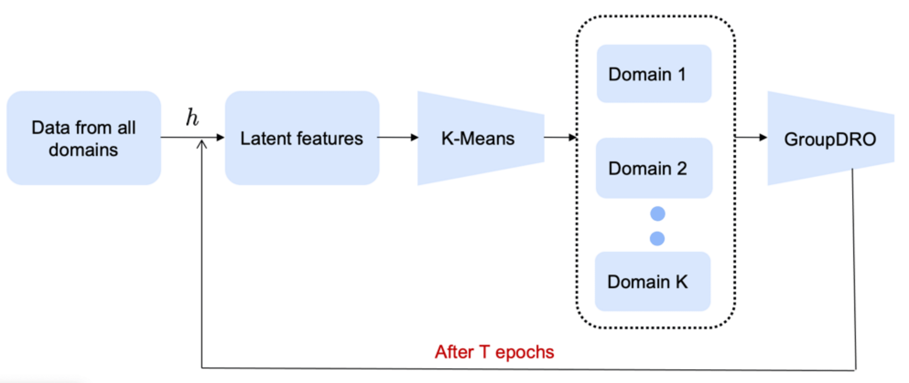
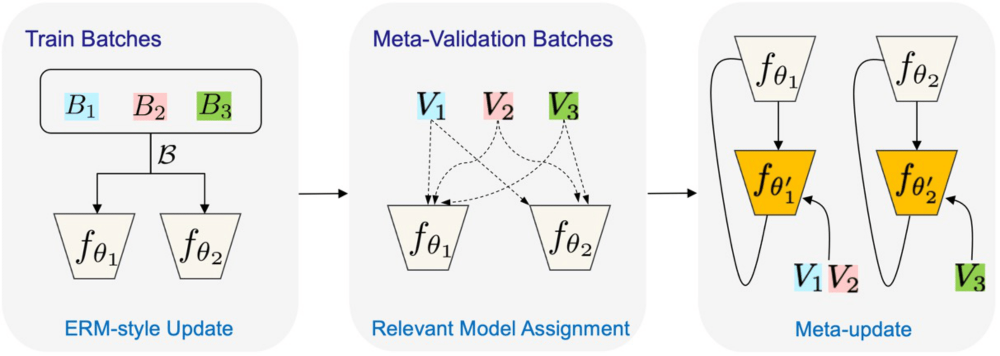
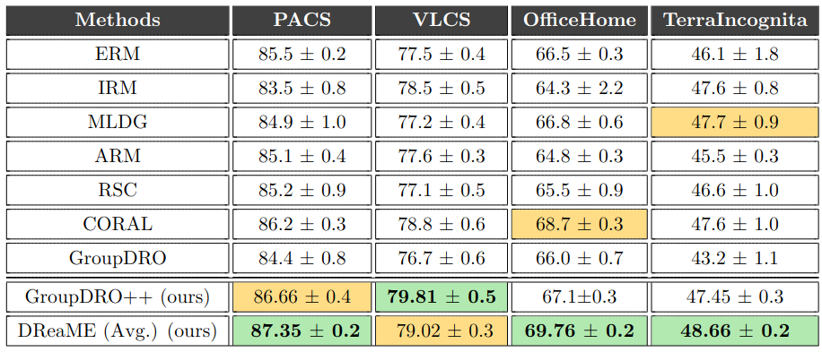

# Welcome to DREAME code base.

This is the code for our paper titled  Automated Domain Discovery from Multiple Sources to Improve Zero-Shot Generalization - https://arxiv.org/abs/2112.09802





**GroupDRO++:**  Here we illustrate our approach for generating
custom domain groups using DeepCluster to improve the GroupDRO technique.





**DREAME++:** Here we illustrate our approach to automatically infer the appropriate domain-labels through a meta-learning approach. 
In the meta-train stage, we compute ERM-style gradients for all models $M_i$ using the data batch $\mathcal{B} \coloneqq \{\mathcal{B}_1,\mathcal{B}_2,\mathcal{B}_3\}$ pooled from all source domains. Next, we use a novel model relevance score computation to assign each meta-validation batch to the most relevant model in the ensemble. Finally, we use a gradient-through-gradient update to learn each of the models $f_{\theta_i}$.


## Quick start

DREAME is written on top of DomainBeD, a PyTorch suite containing benchmark datasets and algorithms for domain generalization, as introduced in (https://arxiv.org/abs/2007.01434).

Download the datasets:

```sh
python -m domainbed.scripts.download \
       --data_dir='DATA'
```

Train a DREAME ensemble with M=2 :

```sh

python3 -m domainbed.scripts.train_aug --data_dir='DATA'\
--dataset OfficeHome --test_env 0 --trial_seed 0\
--output_dir='DREAME_ouputs/OfficeHome_M2/env0/trial_seed0/'\
--hparams='{"batch_size":32,"data_augmentation":1,"DREAME_num_models":2}' 
    
```

## Details
* In domainbed/algorithms.py DREAME is implemented
* Through domainbed/scripts/train_aug.py and domainbed/lib/misc_aug.py we train DREAME
* Once checkpoints are saved, if we want to load and re-evaluate, we use domainbed/scripts/eval_DREAME_aug.py

## Model selection criteria

We use two different model selection criteria Overall Average and Overall Ensemble. More details are provided in paper.

## Results

## Baseline Results.
We report baseline results from the paper In search of lost domain generalization (https://openreview.net/pdf?id=lQdXeXDoWtI) and their github repo.
Full results for [commit 7df6f06](https://github.com/facebookresearch/DomainBed/tree/7df6f06a6f9062284812a3f174c306218932c5e4) in LaTeX format available [here](domainbed/results/2020_10_06_7df6f06/results.tex).

## Citation
Please cite as 
```bash
@article{DBLP:journals/corr/abs-2112-09802,
  author    = {Kowshik Thopalli and
               Sameeksha Katoch and
               Pavan K. Turaga and
               Jayaraman J. Thiagarajan},
  title     = {Automated Domain Discovery from Multiple Sources to Improve Zero-Shot Generalization},
  journal   = {CoRR},
  volume    = {abs/2112.09802},
  year      = {2021},
  url       = {https://arxiv.org/abs/2112.09802},
  eprinttype = {arXiv},
  eprint    = {2112.09802},
}
```